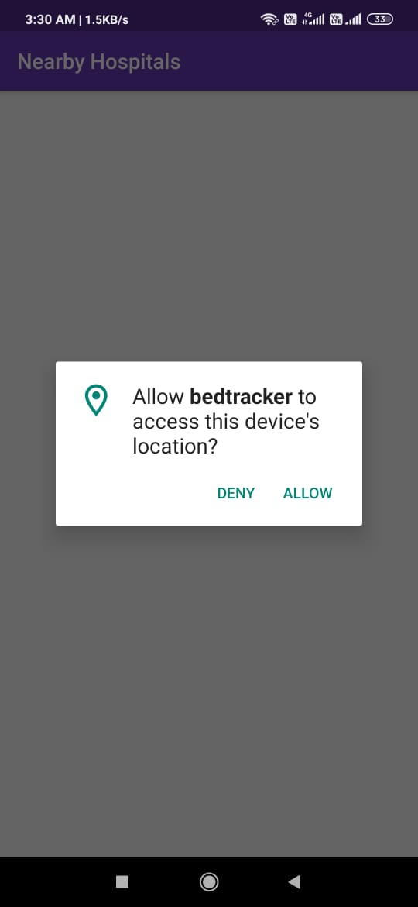
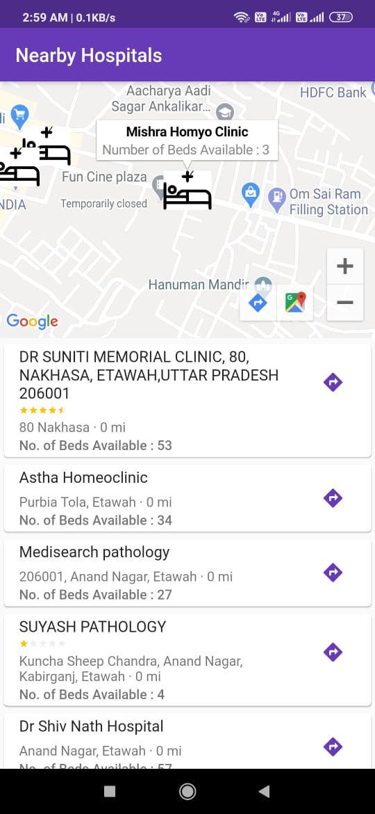
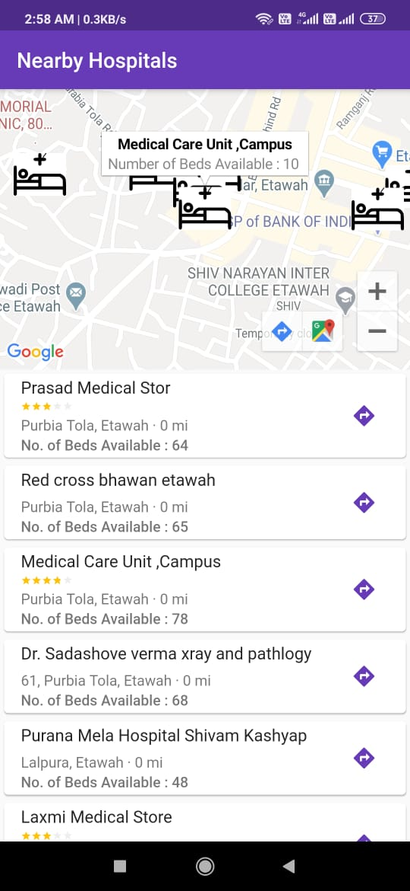
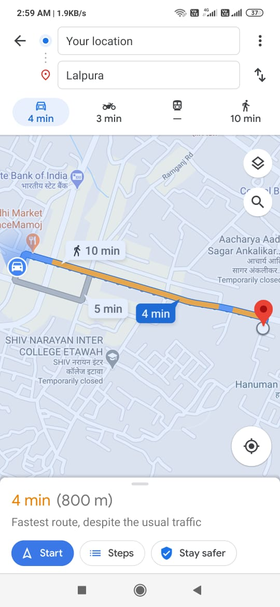

# BedTracker

## PROBLEM IN CURRENT SCENARIO 
The second largest populated country in the world, India faces various hindrances to its development. India’s health ministry did not respond to a request for comment on how it will cope with the predicted rise in infections, given that most public hospitals are overcrowded at the best of times. The federal government has said in media briefings that not all patients need hospitalization and it is making rapid efforts to increase the number of hospital beds and procure health gear.
The federal government’s data from last year showed there were about 714,000 hospital beds in India, up from about 540,000 in 2009. However, given India’s rising population, the number of beds per 1,000 people has grown only slightly in that time.
India has 0.5 beds per 1,000 people, according to the latest data from the Organization for Economic Co-operation and Development (OECD), up from 0.4 beds in 2009, but among lowest of countries surveyed by the OECD. In contrast, China has 4.3 hospital beds per 1,000 people and the United States has 2.8, according to the latest OECD figures.
Hence there is a need of managing this Situation immediately!!!

## PROTOTYPE 
We at Flutterify aim to build an easy and interactive mobile app for both IOS and android users  to track the no. of beds in the nearby Hospitals .
We are using Google  Maps sdk and Places api to find the details of nearest hospital depending upon the user's current  location , using the geolocation package provided by Flutter. As getting the each and every database of all the hospitals is not possible so we are trying to build our own  serverless No SQL  database with the help of   Firebase and cloud Firestore to update the no. of beds .Without going to hospitals users can check  if there is available bed or not !
Hence this small initiative is an effective way to manage the crisis situation 

## Technology STACK

-	Flutter
-	Dart
-	Google Cloud
-	Google Map SDK
-	Places API
-	Gelocation
-	Flutter Provider

## Download the app from [here](https://drive.google.com/file/d/1enrScf2CDmYGD81dje_Ad9NaIKi71cdi/view?usp=sharing).
**steps-** Open the link->click download->click drive->choose your account->click app installer->open app

## PPT Link [here](https://drive.google.com/file/d/1Zo3vQEyWtaTKNXwLose2pGjjssvL3GdD/view?usp=sharing).

## Video Link [here](https://youtu.be/u2Gm5v7YxDI).


## Permissions

* Location/GPS

## Requirements
* Android version 5.0 and above


## Screnshots 
<table>
  <tr>
    <td></td>
    <td></td>
  </tr>
  <tr>
    <td></td>
    <td></td>   
  </tr>
</table>

## Setup on your machine - 

-Open cmd/terminal
-Navigate to your workspace
-Then type in: ```git clone https://github.com/SAMYAK99/TrackaBed```
-Import the Project in Android Studio and start coding!

## To Setup the project properly add the following to local.properties under Gradle Scripts

GOOGLE_MAP_KEY="Add your google map api key"
